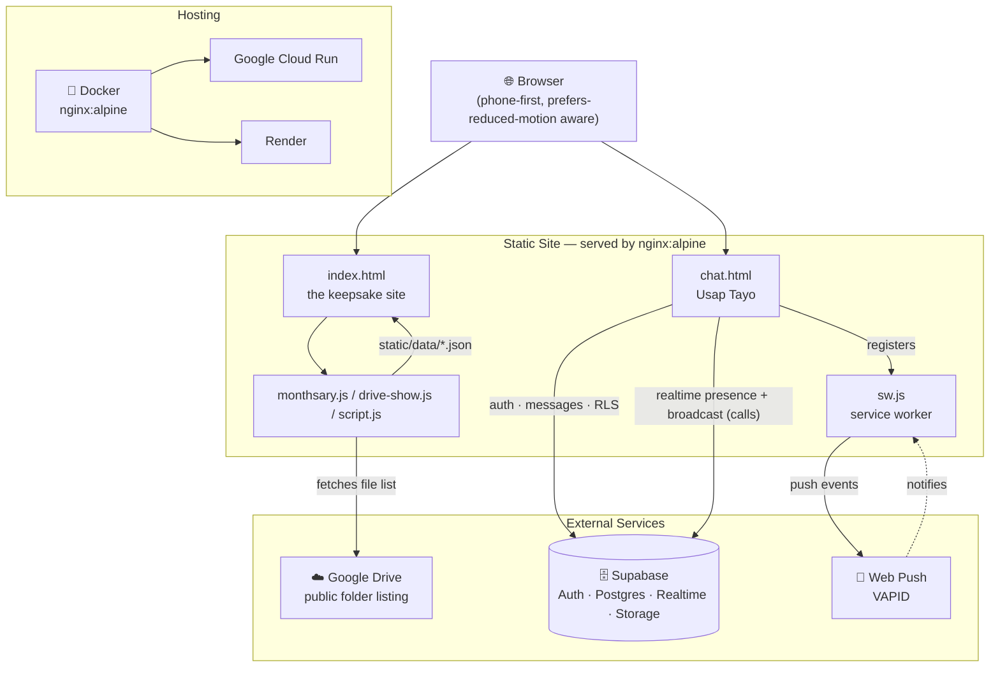

<div align="center">


# Walong Buwan 💌

**A one-time cinematic keepsake website — a monthsary gift that rewrites its own titles, letter, and theme every month, with a private two-person chat built in.**


</div>

---

## 💭 What is this?

**Walong Buwan** ("eight months") is a single-recipient romantic gift site — a dim, cinematic "keepsake box" that walks one specific person through a relationship's story: the first video and photo, a live since-we-met counter, a draggable polaroid archive, sealed poem cards, and a closing letter, all under a looping song. It rewrites itself automatically every month via two JSON files, so no code changes are needed to keep it current. Tucked underneath is **Usap Tayo**, a private two-person chat with realtime messaging, WebRTC calls, and online presence — built entirely on top of the same static site.

```diff
+ Monthsary engine      →  site content (titles, letter, theme) flips automatically on the 11th of every month
+ Draggable photo deck  →  87-photo polaroid slideshow — drag, swipe, arrow keys, auto-advance
+ Cloud slideshow       →  streams photos & videos live from a public Google Drive folder, nothing in the repo
+ Usap Tayo private chat → realtime messages, seen receipts, WebRTC audio/video calls, online presence, push notifications
+ Audio-reactive atmosphere → aurora glow, falling petals, and polaroid sway pulse with the music via Web Audio
```

## 🏗️ Architecture



## ✨ Features

### 🌙 The Monthsary Engine

Every 11th of the month at midnight (PH time), the site rewrites its titles, entry screen, letter, footer, and unsealed poems — no deploys required. Everything lives in two JSON files under `static/data/`, with a `?month=N` query param to preview any month ahead of time.

| File | Controls |
|---|---|
| `static/data/monthsary.json` | Tagalog month-count names, default text templates (`{name}` `{english}` `{ordinalEn}` placeholders), and per-month overrides — including switching the whole site's `theme` (e.g. month 12 flips to a golden "anniversary" dawn) |
| `static/data/poems.json` | Every poem plus the `month` it unseals on — cards appear on their own at midnight |

### 🖼️ Photo Deck & Cloud Slideshow

An 87-photo draggable polaroid deck (`photos.js`) supports drag, swipe, arrow keys, and keyboard nav with a deal-in animation. Alongside it, the "mula sa ating ulap" section streams **448 photos/videos live from a public Google Drive folder** — nothing is copied into the repo or Docker image. Re-sync the list anytime with `node tools/sync-drive-media.mjs`.

### 📜 Poems & the Letter

Eight roman-numeral poem cards with a 3D wax-seal flip, unsealed progressively by the monthsary engine, plus a closing handwritten letter section with scroll-driven lens-focus.

### 🎧 Cinematic Atmosphere

A single global `requestAnimationFrame` loop in `script.js` drives Web Audio analysis (aurora breathes with bass, petal spawn rate follows song energy, polaroids sway to the beat), scroll parallax, a pinned "swelling" interlude, and a scroll-progress thread — with a CSS-only, fixed-timer fallback if `AudioContext` is unavailable, and full `prefers-reduced-motion` support throughout.

### 💬 Usap Tayo — Private Chat

A two-person-only chat (`chat.html`), reachable via a discreet "usap tayo ♡" link under the letter, gated by an anniversary-date question before the login screen even appears. Backend is Supabase (Postgres + Auth + Realtime + Storage), with Row Level Security limiting every table to exactly two `chat_members` accounts.

| Capability | How it works |
|---|---|
| 🔒 Security gate | Asks "when's our anniversary?" (native date picker) before the login screen unlocks, once per browser session |
| 🔑 Login | Tap your name → enter your birthdate as the password (`signInWithPassword`) |
| 💬 Messaging | Realtime `postgres_changes` subscription, image attachments via Supabase Storage, Tagalog date/time labels |
| 👀 Seen receipts | `read_at` column marks messages read on focus; shows a "nakita ♡" tag |
| 🟢 Online presence | Supabase Realtime Presence channel — a pulsing dot shows when the other person also has the chat open |
| 📵 Offline call guard | Calling while the partner isn't online shows a Tagalog prompt instead of ringing into the void |
| ☎️ Audio/video calls | WebRTC peer connection signaled over a Supabase Realtime broadcast channel (offer/answer/ICE/hangup/busy) |
| 🔔 Push notifications | Web Push + VAPID, registered via `sw.js`, suppressed if the recipient already has the chat focused |
| ↻ Manual refresh | Re-fetches the last 100 messages on demand, in case a realtime event ever got dropped |

Full build/decision log: [`CHAT_PLAN.md`](CHAT_PLAN.md).

## 📁 Project structure

```
e-and-a/
├── index.html                  # the keepsake site — entry, firsts, counter, deck, poems, letter
├── styles.css                  # all site styling, animations, reduced-motion fallbacks
├── script.js                   # preloader, audio analyser, cinema rAF loop, deck/poem logic, counter
├── monthsary.js                # monthsary engine — computes the current month, applies overrides
├── drive-show.js                # cloud slideshow — fetches & renders static/data/drive-media.json
├── photos.js                   # generated array of 87 static/opt/*.jpg paths
│
├── chat.html / chat.css / chat.js   # Usap Tayo — private two-person chat, calls, presence
├── sw.js                       # service worker for Usap Tayo push notifications
├── supabase.min.js             # vendored Supabase JS client
│
├── static/
│   ├── data/
│   │   ├── monthsary.json      # month names, text templates, per-month overrides
│   │   ├── poems.json          # poem text + unlock month
│   │   └── drive-media.json    # generated Google Drive file list (id/name/type)
│   ├── opt/                    # web-optimized photos + first_vid.mp4 (served to visitors)
│   ├── music.mp3
│   └── *.jpg / *.mp4           # original full-res assets (excluded from the Docker image)
│
├── tools/
│   └── sync-drive-media.mjs    # regenerates static/data/drive-media.json from a public Drive folder
│
├── Dockerfile                  # nginx:alpine, envsubst PORT templating
├── nginx.conf.template         # cache rules: media 30d immutable, html/js/css/json no-cache
├── .dockerignore                # keeps ~528 MB of originals out of the image
│
├── CHAT_PLAN.md                 # Usap Tayo build & decision log
├── PRODUCT.md                    # brand/tone/design-constraints brief
└── README.md
```

## 🚀 Getting started

### Prerequisites

- Any static file server (Python 3, `npx serve`, etc.) — **no build step, no package manager, no framework**
- [Docker](https://www.docker.com/) — optional, for a container-parity run or deploy
- Node.js 18+ — only needed to run `tools/sync-drive-media.mjs`
- A Supabase project (only if you're standing up your own copy of the Usap Tayo chat)

### Local setup

```powershell
# 1. clone
git clone https://github.com/erar404/a-and-e.git
cd a-and-e

# 2. serve it — any static server works
python -m http.server 8080
# then open http://localhost:8080

# 3. (optional) preview a specific monthsary month
#    http://localhost:8080/?month=12

# 4. (optional) skip the entry-gate click while developing
#    http://localhost:8080/#open
#    http://localhost:8080/#open+letter   (jump straight to a section)
```

Or with Docker, for container parity:

```powershell
docker build -t walong-buwan .
docker run -p 8080:8080 walong-buwan
```

> **No environment variables to configure.** The site has no server-side secrets — the Supabase project URL and *publishable* key live directly in `chat.js`, and access is enforced entirely by Row Level Security on the Supabase side (only the two seeded `chat_members` accounts can read or write anything).

## ☁️ Deployment

**Google Cloud Run:**

```powershell
gcloud run deploy walong-buwan --source . --region asia-southeast1 --allow-unauthenticated
```

Cloud Run builds the `Dockerfile`, injects `PORT`, and returns a URL — nothing else to configure.

**Render:**

1. Push this repo to GitHub (already at [`erar404/a-and-e`](https://github.com/erar404/a-and-e)).
2. Render Dashboard → **New → Web Service** → connect the repo.
3. Runtime: **Docker**. No other settings needed — the container honors Render's `PORT`.

```diff
- Do not bake real Supabase service-role keys or secrets into the image — only the
- RLS-safe publishable key belongs in client-side JS.
```

## 🔗 Related applications

<table>
<tr><th>Name</th><th>Role</th></tr>
<tr>
  <td><strong>Supabase (bandapa project)</strong></td>
  <td>Backend for Usap Tayo: Auth, <code>chat_members</code>/<code>chat_messages</code> tables with RLS, Realtime (postgres_changes + presence + broadcast), Storage for image attachments</td>
</tr>
<tr>
  <td><strong>Google Drive (public folder)</strong></td>
  <td>Source of the "cloud slideshow" — photos/videos are streamed directly from Drive; refreshed locally via <code>tools/sync-drive-media.mjs</code></td>
</tr>
<tr>
  <td><strong>GitHub — erar404/a-and-e</strong></td>
  <td>Source repo; connected to Render/Cloud Run for container builds</td>
</tr>
</table>

## 🛠️ Tech stack

| Layer | Technology |
|---|---|
| Markup / Styling | Vanilla HTML5 + CSS3 (custom properties, no framework) |
| Scripting | Vanilla JavaScript (ES6+), no build step |
| Fonts | Cormorant Garamond + La Belle Aurore (Google Fonts) |
| Backend (chat) | Supabase — Postgres, Auth, Realtime, Storage |
| Calls | WebRTC, signaled over Supabase Realtime broadcast channels |
| Notifications | Web Push API + VAPID, via a dedicated service worker |
| Media pipeline | ffmpeg (offline optimization: photos → `static/opt/`, HEVC → H.264 video) |
| Container | nginx:alpine with `envsubst`-templated config |
| Hosting | Google Cloud Run or Render (Docker runtime) |

---

<div align="center">
  <sub>isang alaala, isang buwan sa isang pagkakataon · © 2026 Walong Buwan ♡</sub>
</div>
