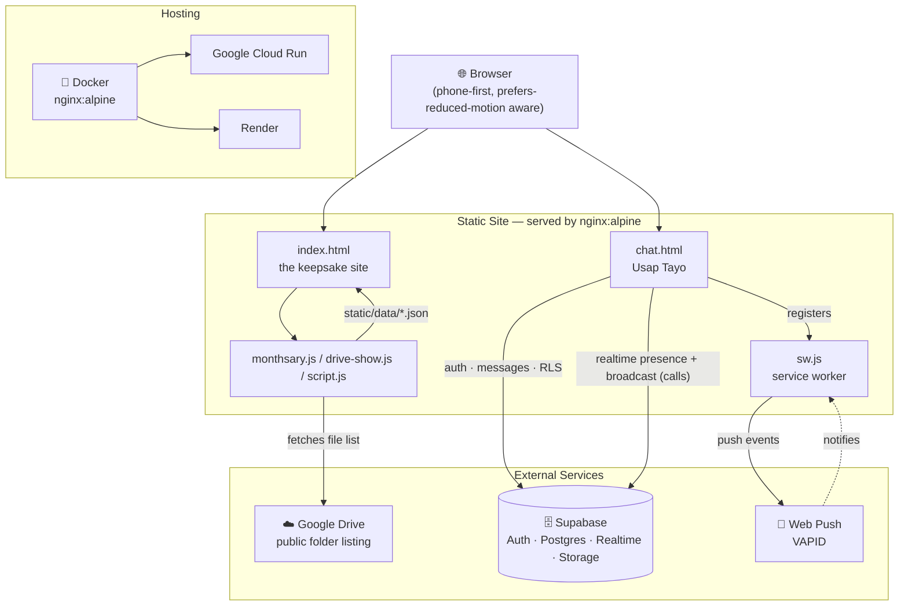

<div align="center">


# Walong Buwan 💌

**A one-time cinematic keepsake website — a monthsary gift that rewrites its own titles, letter, and theme every month, with a private two-person chat built in.**


</div>

---

## 💭 What is this?

**Walong Buwan** ("eight months") is a single-recipient romantic gift site — a dim, cinematic "keepsake box" that walks one specific person through a relationship's story: the first video and photo, a live since-we-met counter, a draggable polaroid archive, sealed poem cards, and a closing letter, all under a looping song. It rewrites itself automatically every month via two JSON files, so no code changes are needed to keep it current. Tucked underneath is **Usap Tayo**, a private two-person chat with realtime messaging, WebRTC calls, and online presence — built entirely on top of the same static site.

```diff
+ Monthsary engine      →  site content (titles, letter, theme) flips automatically on the 11th of every month
+ Draggable photo deck  →  87-photo polaroid slideshow — drag, swipe, arrow keys, auto-advance
+ Cloud slideshow       →  streams photos & videos live from a public Google Drive folder, nothing in the repo
+ Usap Tayo private chat → realtime messages, seen receipts, WebRTC audio/video calls, online presence, push notifications
+ Audio-reactive atmosphere → aurora glow, falling petals, and polaroid sway pulse with the music via Web Audio
```

## 🏗️ Architecture


```mermaid
graph TD
    Browser["🌐 Browser<br/>(phone-first, prefers-reduced-motion aware)"]

    subgraph Static["Static Site — served by nginx:alpine"]
        Index["index.html<br/>the keepsake site"]
        Chat["chat.html<br/>Usap Tayo"]
        SW["sw.js<br/>service worker"]
        Engine["monthsary.js / drive-show.js / script.js"]
    end

    subgraph External["External Services"]
        Drive["☁️ Google Drive<br/>public folder listing"]
        Supabase[("🗄️ Supabase<br/>Auth · Postgres · Realtime · Storage")]
        WebPush["🔔 Web Push<br/>VAPID"]
    end

    subgraph Hosting["Hosting"]
        Docker["🐳 Docker<br/>nginx:alpine"]
        CloudRun["Google Cloud Run"]
        Render["Render"]
    end

    Browser --> Index
    Browser --> Chat
    Index --> Engine
    Engine -- "static/data/*.json" --> Index
    Engine -- "fetches file list" --> Drive
    Chat -- "auth · messages · RLS" --> Supabase
    Chat -- "realtime presence + broadcast (calls)" --> Supabase
    Chat -- registers --> SW
    SW -- "push events" --> WebPush
    WebPush -.notifies.-> SW

    Docker --> CloudRun
    Docker --> Render
```

## ✨ Features

### 🌙 The Monthsary Engine

Every 11th of the month at midnight (PH time), the site rewrites its titles, entry screen, letter, footer, and unsealed poems — no deploys required. Everything lives in two JSON files under `static/data/`, with a `?month=N` query param to preview any month ahead of time.

| File | Controls |
|---|---|
| `static/data/monthsary.json` | Tagalog month-count names, default text templates (`{name}` `{english}` `{ordinalEn}` placeholders), and per-month overrides — including switching the whole site's `theme` (e.g. month 12 flips to a golden "anniversary" dawn) |
| `static/data/poems.json` | Every poem plus the `month` it unseals on — cards appear on their own at midnight |

### 🖼️ Photo Deck & Cloud Slideshow

An 87-photo draggable polaroid deck (`photos.js`) supports drag, swipe, arrow keys, and keyboard nav with a deal-in animation. Alongside it, the "mula sa ating ulap" section streams **448 photos/videos live from a public Google Drive folder** — nothing is copied into the repo or Docker image. The order is reshuffled every visit, and slides show when they were taken and which monthsary month that fell in (computed with the same whole-month rule the monthsary engine itself uses) — for videos that's read straight from Android's own `VID_YYYYMMDD_...` filename convention (no API needed); for photos it's the file's real EXIF `DateTimeOriginal`, fetched via the Drive API when re-syncing. An earlier version guessed photo dates from a 13-digit number some filenames carried — that turned out to be an export timestamp, not the capture date, so it showed the wrong day; photos without a fetched EXIF date now simply show no date rather than a guessed one.

> To backfill real photo dates: Google Cloud Console → enable **Google Drive API** on a project (the same one as `YOUTUBE_API_KEY` works fine) → Credentials → Create API key. No application restriction needed — this key is only ever used locally by `sync-drive-media.mjs`, never shipped to the browser; just restrict its **API restrictions** to Google Drive API. Then:
>
> ```powershell
> $env:GOOGLE_DRIVE_API_KEY = "..."
> node tools/sync-drive-media.mjs
> ```

### 📜 Poems, the Letter & the Letters Archive

Eight roman-numeral poem cards with a 3D wax-seal flip, unsealed progressively by the monthsary engine, plus a closing handwritten letter section with scroll-driven lens-focus. "basahin muli ang mga naunang sulat ♡" opens a modal (`letters-archive.js`) listing every past monthsary letter as tabs, reusing the same `static/data/monthsary.json` the live envelope surprise (`monthsary-timer.js`) draws from — so a written month stays readable anytime, not just the one day it first arrived.

### 🎧 Cinematic Atmosphere

A single global `requestAnimationFrame` loop in `script.js` drives Web Audio analysis (aurora breathes with bass, petal spawn rate follows song energy, polaroids sway to the beat), scroll parallax, a pinned "swelling" interlude, and a scroll-progress thread — with a CSS-only, fixed-timer fallback if `AudioContext` is unavailable, and full `prefers-reduced-motion` support throughout.

### 💬 Usap Tayo — Private Chat

A two-person-only chat (`chat.html`), reachable via a discreet "usap tayo ♡" link under the letter, gated by an anniversary-date question before the login screen even appears. Backend is Supabase (Postgres + Auth + Realtime + Storage), with Row Level Security limiting every table to exactly two `chat_members` accounts.

| Capability | How it works |
|---|---|
| 🔒 Security gate | Asks "when's our anniversary?" (native date picker) before the login screen unlocks, once per browser session |
| 🔑 Login | Tap your name → enter your birthdate as the password (`signInWithPassword`) |
| 💬 Messaging | Realtime `postgres_changes` subscription, image attachments via Supabase Storage, Tagalog date/time labels |
| 👀 Seen receipts | `read_at` column marks messages read on focus; shows a "nakita ♡" tag |
| 🟢 Online presence | Supabase Realtime Presence channel — a pulsing dot shows when the other person also has the chat open |
| 📵 Offline call guard | Calling while the partner isn't online shows a Tagalog prompt instead of ringing into the void |
| ☎️ Audio/video calls | WebRTC peer connection signaled over a Supabase Realtime broadcast channel (offer/answer/ICE/hangup/busy) |
| 🔔 Push notifications | Web Push + VAPID, registered via `sw.js`, suppressed if the recipient already has the chat focused |
| ↻ Manual refresh | Re-fetches the last 100 messages on demand, in case a realtime event ever got dropped |
| 🎵 `play <link or text>` | A direct YouTube link/playlist plays immediately; plain text shows a top-5 search picker (`yt-player.js`) |
| ⏭ `play next <link or text>` | Queues instead of interrupting — falls back to playing immediately if nothing's loaded; auto-advances on track end, error, or ⏭ |
| 🎧 "now playing" indicator | While your partner's player is actually playing (not just paused), a small line under the header shows what — same Presence channel as the typing indicator |
| 🤖 `jipiti <prompt>` | Sends normally, then a Python bridge (`jipiti/main.py`) asks ChatGPT and posts the reply for both of you to see (`jipiti.js`) |
| 💗 "mahal kita" counter | Any new message containing "I love you" / "mahal kita" triggers a bouncy heart-burst popup for both of you, tallying every time it's ever been said (`body.ilike.%...%` count query, no new backend) |

`index.html`'s public "the chat count" section (`chat-counter.js`) shows the running total of Usap Tayo messages — it calls a `public.chat_message_count()` Postgres function (`SECURITY DEFINER`, granted to `anon`) that returns only a number, never row content, so the total is visible on the public landing page without weakening the RLS that protects the messages themselves.

Full build/decision log: [`CHAT_PLAN.md`](CHAT_PLAN.md).

## 📁 Project structure

```
e-and-a/
├── index.html                  # the keepsake site — entry, firsts, counter, deck, poems, letter
├── styles.css                  # all site styling, animations, reduced-motion fallbacks
├── script.js                   # preloader, audio analyser, cinema rAF loop, deck/poem logic, counter
├── monthsary.js                # monthsary engine — computes the current month, applies overrides
├── monthsary-timer.js           # the live monthsary-day envelope surprise (current month only)
├── letters-archive.js           # "basahin muli..." modal — every past monthsary letter, on demand
├── drive-show.js                # cloud slideshow — fetches & renders static/data/drive-media.json (shuffled, dated)
├── photos.js                   # generated array of 87 static/opt/*.jpg paths
├── chat-counter.js              # "the chat count" section — total Usap Tayo messages, via a count-only RPC
│
├── chat.html / chat.css / chat.js   # Usap Tayo — private two-person chat, calls, presence
├── yt-player.js / yt-config.js.template  # "play <link/text>" audio bar + YouTube search picker
├── jipiti.js                    # "jipiti <prompt>" — pings the bot backend below
├── sw.js                       # service worker for Usap Tayo push notifications
├── supabase.min.js             # vendored Supabase JS client
│
├── jipiti/
│   └── main.py                 # stdlib-only ChatGPT bridge; nginx proxies /api/jipiti to it
│
├── docker/
│   ├── 30-start-jipiti.sh        # launches jipiti/main.py in the background (a /docker-entrypoint.d/ script)
│   └── 40-yt-config.sh          # renders yt-config.js from YOUTUBE_API_KEY (also /docker-entrypoint.d/)
│
├── static/
│   ├── data/
│   │   ├── monthsary.json      # month names, text templates, per-month overrides
│   │   ├── poems.json          # poem text + unlock month
│   │   └── drive-media.json    # generated Google Drive file list (id/name/type)
│   ├── opt/                    # web-optimized photos + first_vid.mp4 (served to visitors)
│   ├── music.mp3
│   └── *.jpg / *.mp4           # original full-res assets (excluded from the Docker image)
│
├── tools/
│   └── sync-drive-media.mjs    # regenerates static/data/drive-media.json; GOOGLE_DRIVE_API_KEY backfills real photo EXIF dates
│
├── Dockerfile                  # nginx:alpine + python3, custom entrypoint, envsubst PORT templating
├── nginx.conf.template         # cache rules, /api/jipiti proxy to the local python process
├── .dockerignore                # keeps ~528 MB of originals out of the image
│
├── CHAT_PLAN.md                 # Usap Tayo build & decision log
├── PRODUCT.md                    # brand/tone/design-constraints brief
└── README.md
```

## 🚀 Getting started

### Prerequisites

- Any static file server (Python 3, `npx serve`, etc.) — **no build step, no package manager, no framework**
- [Docker](https://www.docker.com/) — optional, for a container-parity run or deploy
- Node.js 18+ — only needed to run `tools/sync-drive-media.mjs`
- A Supabase project (only if you're standing up your own copy of the Usap Tayo chat)

### Local setup

```powershell
# 1. clone
git clone https://github.com/erar404/a-and-e.git
cd a-and-e

# 2. serve it — any static server works
python -m http.server 8080
# then open http://localhost:8080

# 3. (optional) preview a specific monthsary month
#    http://localhost:8080/?month=12

# 4. (optional) skip the entry-gate click while developing
#    http://localhost:8080/#open
#    http://localhost:8080/#open+letter   (jump straight to a section)
```

Or with Docker, for container parity:

```powershell
docker build -t walong-buwan .
docker run -p 8080:8080 walong-buwan
```

> **No required environment variables** for the site itself — the Supabase project URL and *publishable* key live directly in `chat.js`, and access is enforced entirely by Row Level Security on the Supabase side (only the two seeded `chat_members` accounts can read or write anything). Two features add **optional** vars, both consumed only inside the container — never committed, never shipped to the browser except where noted:
>
> - **`YOUTUBE_API_KEY`** powers `chat.html`'s "play `<song title>`" search (top-5 picker instead of a direct link). Without it the direct-link form of "play" still works; only the text-search form shows a friendly "not set up" message. At container startup, `docker/40-yt-config.sh` renders `yt-config.js.template` → `yt-config.js` (loaded by the browser) with whatever the platform injects — same `envsubst` trick the Dockerfile already uses for `PORT`. Get a free key from [Google Cloud Console](https://console.cloud.google.com/) (enable **YouTube Data API v3**, create an API key, restrict it to that API + your site's HTTP referrer). The free tier's default quota (10,000 units/day, 100 units per search) is good for ~100 searches/day.
> - **`GPT_API_KEY`** + **`SUPABASE_SERVICE_ROLE_KEY`** power `chat.html`'s "jipiti `<prompt>`" command — the message sends normally, and `jipiti/main.py` (a stdlib-only Python process nginx proxies `/api/jipiti` to, started by `docker/30-start-jipiti.sh` alongside nginx in the same container — see that file) asks OpenAI (model via optional `GPT_MODEL`, default `gpt-4o-mini`) and posts the reply back into `chat_messages` as a dedicated `GPT` sender, so it lands for both of you through the chat's existing Realtime subscription. **Unlike the YouTube key, these two never reach the browser** — `main.py` only listens on `127.0.0.1`, nginx is the only thing that can reach it. The service-role key bypasses RLS on purpose (needed to insert as the bot account) but `main.py` re-checks the caller's Supabase access token against `chat_members` before doing anything, so only Erwin/Alliah can trigger it.

## ☁️ Deployment

**Google Cloud Run:**

```powershell
gcloud run deploy walong-buwan --source . --region asia-southeast1 --allow-unauthenticated
```

Cloud Run builds the `Dockerfile`, injects `PORT`, and returns a URL. Add `--set-env-vars YOUTUBE_API_KEY=...,GPT_API_KEY=...,SUPABASE_SERVICE_ROLE_KEY=...` for the optional features above.

**Render:**

1. Push this repo to GitHub (already at [`erar404/a-and-e`](https://github.com/erar404/a-and-e)).
2. Render Dashboard → **New → Web Service** → connect the repo.
3. Runtime: **Docker**. The container honors Render's `PORT` automatically.
4. Optional: Render Dashboard → **Environment** → add `YOUTUBE_API_KEY` for song search, and/or `GPT_API_KEY` + `SUPABASE_SERVICE_ROLE_KEY` (Supabase Dashboard → Project Settings → API → `service_role` secret) for "jipiti".

```diff
- Do not bake real Supabase service-role keys or secrets into the image — only the
- RLS-safe publishable key belongs in client-side JS. GPT_API_KEY and
- SUPABASE_SERVICE_ROLE_KEY are the one intentional exception: they're read
- server-side only, by jipiti/main.py, which never exposes them to the browser.
```

## 🔗 Related applications

<table>
<tr><th>Name</th><th>Role</th></tr>
<tr>
  <td><strong>Supabase (bandapa project)</strong></td>
  <td>Backend for Usap Tayo: Auth, <code>chat_members</code>/<code>chat_messages</code> tables with RLS, Realtime (postgres_changes + presence + broadcast), Storage for image attachments</td>
</tr>
<tr>
  <td><strong>Google Drive (public folder)</strong></td>
  <td>Source of the "cloud slideshow" — photos/videos are streamed directly from Drive; refreshed locally via <code>tools/sync-drive-media.mjs</code></td>
</tr>
<tr>
  <td><strong>GitHub — erar404/a-and-e</strong></td>
  <td>Source repo; connected to Render/Cloud Run for container builds</td>
</tr>
</table>

## 🛠️ Tech stack

| Layer | Technology |
|---|---|
| Markup / Styling | Vanilla HTML5 + CSS3 (custom properties, no framework) |
| Scripting | Vanilla JavaScript (ES6+), no build step |
| Fonts | Cormorant Garamond + La Belle Aurore (Google Fonts) |
| Backend (chat) | Supabase — Postgres, Auth, Realtime, Storage |
| Calls | WebRTC, signaled over Supabase Realtime broadcast channels |
| Notifications | Web Push API + VAPID, via a dedicated service worker |
| Media pipeline | ffmpeg (offline optimization: photos → `static/opt/`, HEVC → H.264 video) |
| Container | nginx:alpine with `envsubst`-templated config |
| Hosting | Google Cloud Run or Render (Docker runtime) |

---

<div align="center">
  <sub>isang alaala, isang buwan sa isang pagkakataon · © 2026 Walong Buwan ♡</sub>
</div>
